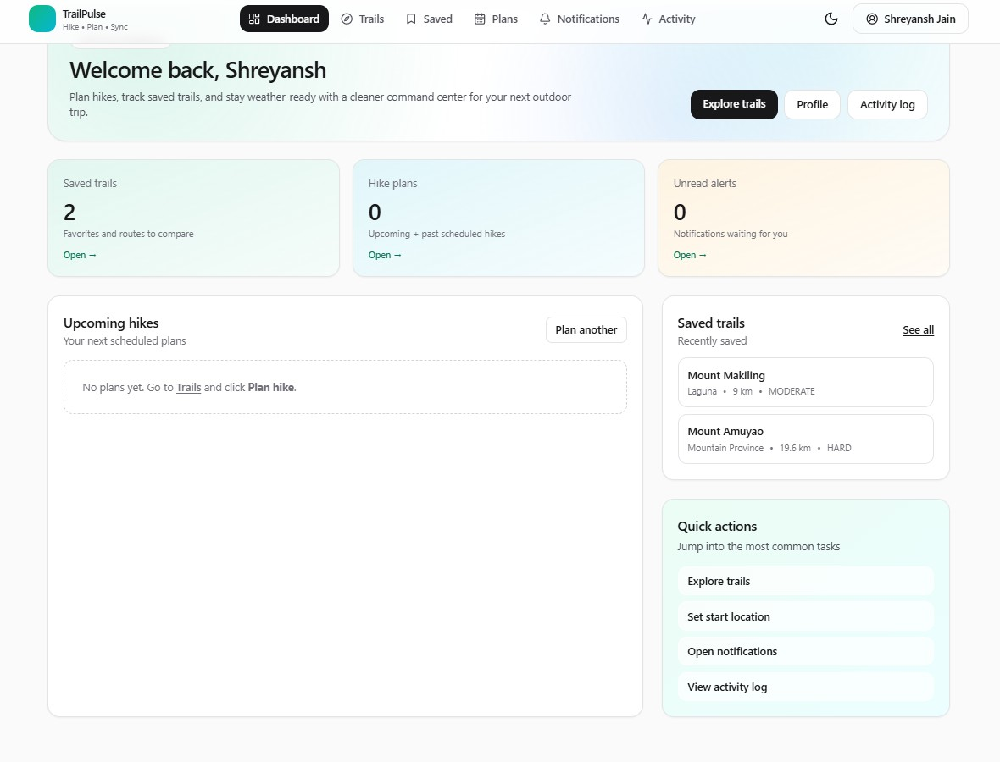
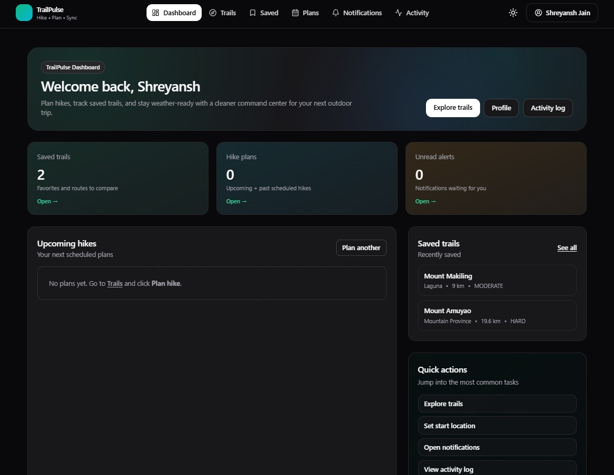
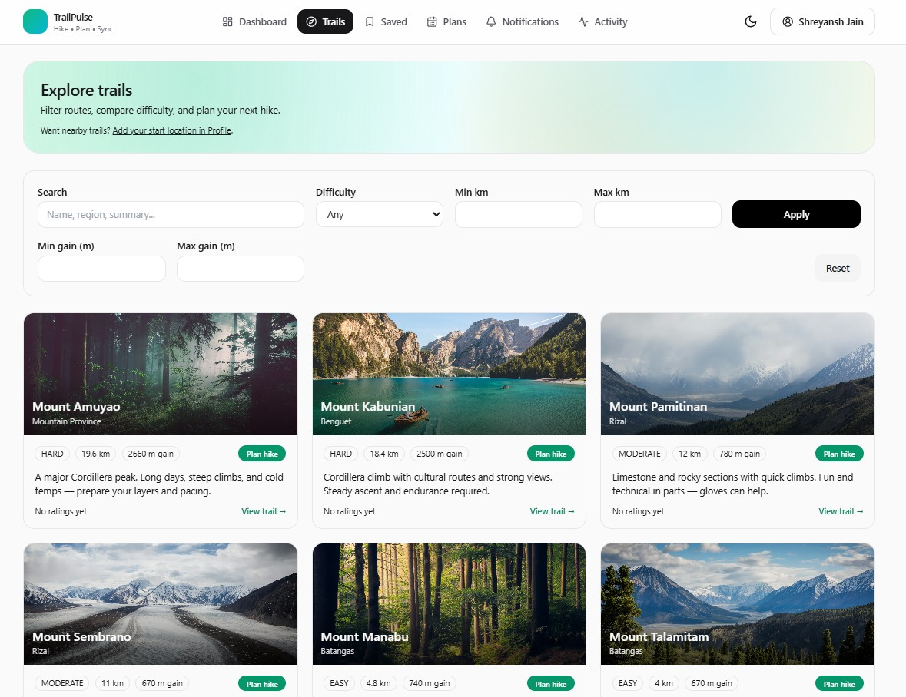
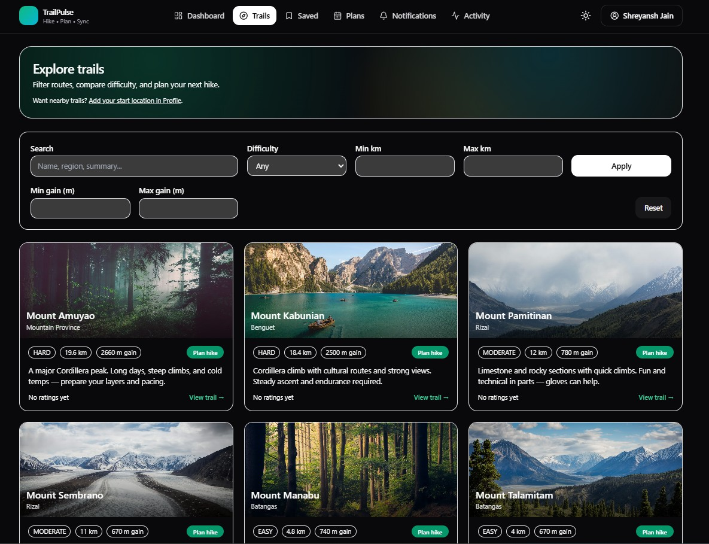
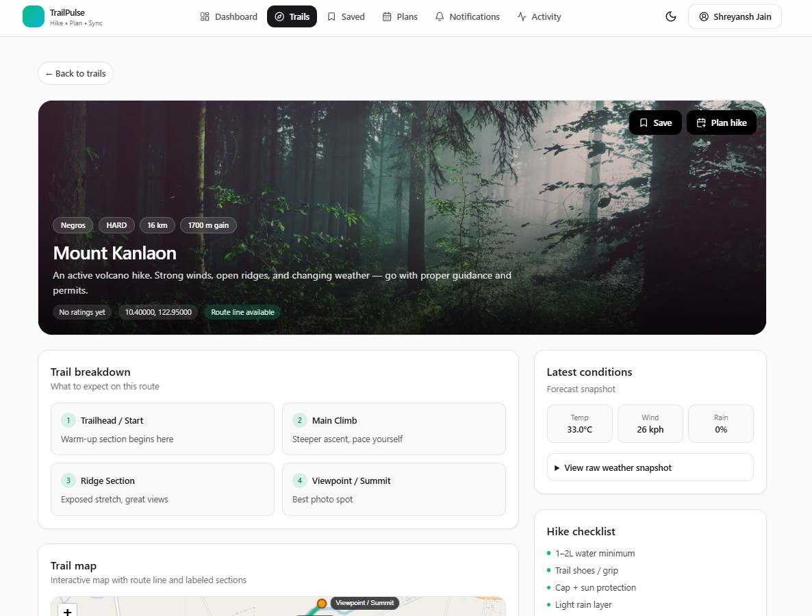
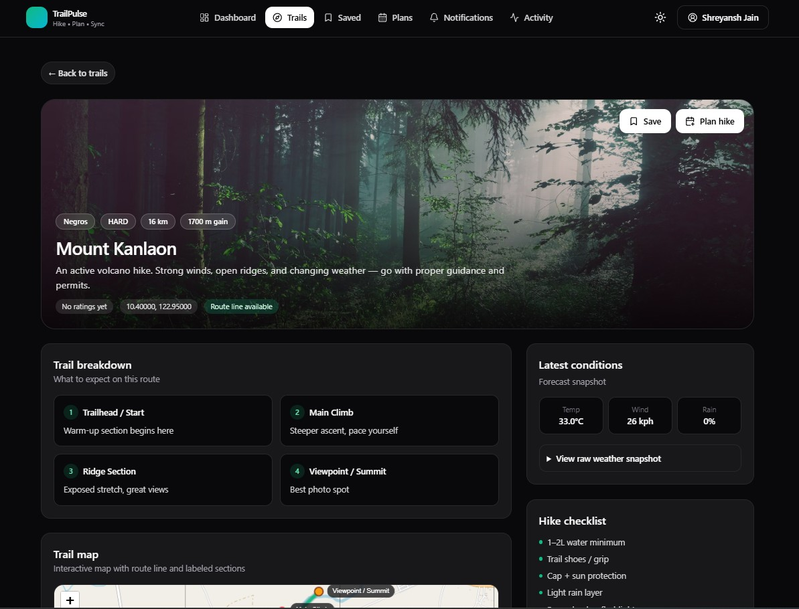
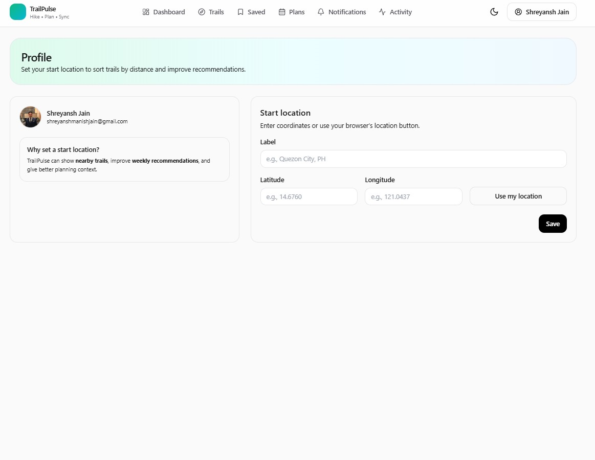
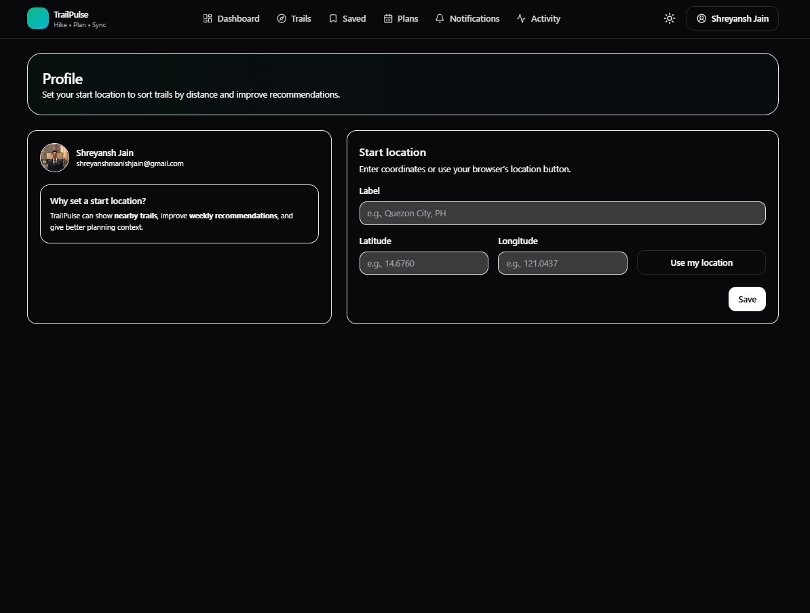

# TrailPulse 🥾🌿
**Hike • Plan • Sync** — A modern hiking trail discovery + planning app with Google OAuth, Google Calendar sync, and background jobs.

TrailPulse is built like a real production app: **secure auth**, **object-level authorization**, **rate-limited APIs**, **audit logs**, **jobs monitoring**, and “product” features like weather snapshots + weekly picks.

---

## ✨ Highlights

- ✅ Google OAuth login (Auth.js / NextAuth v5)
- ✅ Trail discovery (seeded dataset, filters + search)
- ✅ Save trails + plan hikes (notes + checklist)
- ✅ Google Calendar event creation for planned hikes
- ✅ Background jobs (BullMQ) for:
  - Weather sync (Open-Meteo)
  - Digest notifications (weekly picks)
  - Plan reminders (24h / 3h / 30m) *(if enabled in your worker build)*
- ✅ In-app notifications + activity/audit logging
- ✅ Admin Jobs Dashboard (job runs, failures, retries)
- ✅ Premium UI with Tailwind + shadcn/ui-style components
- ✅ Light/Dark mode

---

## 📸 Screenshots

| Page | Light | Dark |
|------|------|------|
| Dashboard |  |  |
| Trails |  |  |
| Trail Detail |  |  |
| Profile |  |  |

## 🧱 Tech Stack

- **Next.js 15** (App Router) + **TypeScript**
- **Auth.js / NextAuth v5** (Google OAuth)
- **Prisma ORM** + **PostgreSQL**
- **Redis + BullMQ** (background jobs)
- **TailwindCSS** + shadcn/ui-style components
- **Zod** validation
- **Security headers** via middleware

---

## ✅ Prerequisites

- Node.js **18+** (Node 20+ recommended)
- pnpm (recommended) or npm/yarn
- Docker Desktop (Postgres + Redis)
- Google Cloud project with OAuth credentials

---

## 🔐 Google OAuth Setup

Google Cloud Console → **APIs & Services → Credentials**

1. Create **OAuth Client ID** → Application type: **Web application**
2. Add **Authorized JavaScript origins**:
   - `http://localhost:3000`
3. Add **Authorized redirect URIs**:
   - `http://localhost:3000/api/auth/callback/google`
4. Copy:
   - `GOOGLE_CLIENT_ID`
   - `GOOGLE_CLIENT_SECRET`

### Scopes used
- `openid email profile`
- `https://www.googleapis.com/auth/calendar.events` *(create calendar events)*

---

## ⚙️ Environment Variables

```bash
cp .env.example .env
```

Fill at minimum:
- `NEXTAUTH_URL=http://localhost:3000`
- `NEXTAUTH_SECRET=...`
- `DATABASE_URL=postgresql://...`
- `REDIS_URL=redis://...`
- `GOOGLE_CLIENT_ID=...`
- `GOOGLE_CLIENT_SECRET=...`
- `ADMIN_EMAILS=your.email@gmail.com` *(optional admin access)*

---

## 🐳 Start Postgres + Redis

```bash
docker compose up -d
```

---

## 📦 Install Dependencies

```bash
pnpm i
```

---

## 🗄️ Prisma: migrate + seed (30+ trails)

These match your `package.json` scripts:

```bash
pnpm prisma:generate
pnpm prisma:migrate
pnpm prisma:seed
```

---

## ▶️ Run the app

### Terminal A (web)
```bash
pnpm dev
```

### Terminal B (worker)
```bash
pnpm worker:dev
```

### Run both together
```bash
pnpm all:dev
```

Open:
- Web: `http://localhost:3000`
- Sign in: `http://localhost:3000/signin`
- Trails: `http://localhost:3000/trails`
- Dashboard: `http://localhost:3000/dashboard`
- Profile: `http://localhost:3000/profile`
- Jobs Admin (ADMIN only): `http://localhost:3000/jobs-admin`

---

## 🧠 What the background jobs do

### `weatherSync` (repeatable)
- Runs every `WEATHER_SYNC_EVERY_HOURS`
- Finds trails saved/planned by any user
- Fetches conditions via Open-Meteo
- Stores snapshots into `WeatherSnapshot`

### `digest` (repeatable)
- Runs daily at `DIGEST_HOUR_LOCAL`
- Writes a “Weekly picks” notification per user

### `planReminders` (repeatable) *(if enabled)*
- Runs on a schedule (e.g., every 15 minutes)
- Sends reminders:
  - 24 hours before
  - 3 hours before
  - 30 minutes before
- Writes into `Notification` table

---

## 🔒 Security (what’s implemented)

- **Server-side validation**: Zod on every write endpoint
- **Object-level authorization**: users can only access their own plans/notifications/etc.
- **Secure sessions**: DB sessions + HttpOnly cookies (Auth.js defaults)
- **CSRF**: Auth.js default protections + same-site cookies
- **Rate limiting (Redis)** on spammy endpoints:
  - Plans create
  - Save trail
  - Calendar create
  - Notifications read
  - Jobs retry (admin)
- **Audit logs**:
  - auth events
  - authorization denials
  - job runs
- **Security headers** in middleware:
  - CSP starter
  - nosniff
  - frame protection
  - referrer policy
  - permissions policy

---

## ✅ Verification Checklist

### Cookies & sessions
- Sign in with Google
- DevTools → Application → Cookies:
  - session cookies should be **HttpOnly**
  - `SameSite=Lax`
  - `Secure=true` in production (HTTPS)

### Authz denial tests
- Open another user’s plan ID: should return **404**
- Calendar create with wrong planId: should return **403**

### Rate limiting
- Rapidly spam plan creation: expect **429 Too many requests**
- Spam calendar creation: expect **429**

### Headers
- DevTools → Network → Response headers include:
  - `Content-Security-Policy`
  - `X-Content-Type-Options: nosniff`
  - `X-Frame-Options: DENY`
  - `Referrer-Policy`

### Jobs Admin
- Add your email to `ADMIN_EMAILS`, sign out/in again
- Visit `/jobs-admin`
- Confirm:
  - queue counts show
  - recent JobRun entries show
  - retry button appears for failed jobs

---

## 🧪 Tests (optional)

```bash
pnpm test
```

---

## 📁 Repo Structure

- `app/` — Next.js App Router pages + API route handlers
- `src/server/` — Prisma/Redis/authz/rate-limit + integrations (Calendar, OSM, Wikimedia)
- `src/worker/` — BullMQ worker + repeatable jobs
- `prisma/` — schema, migrations, seed
- `docker-compose.yml` — Postgres + Redis

---

## 🚀 Roadmap (flagship upgrades)

- Real route imports (GPX upload / bulk OSM Overpass sync)
- Trail comparisons (2–3 trails side-by-side)
- Plan share links (tokenized, public read-only)
- PWA offline packing mode
- Better observability (health endpoint, structured logs)
